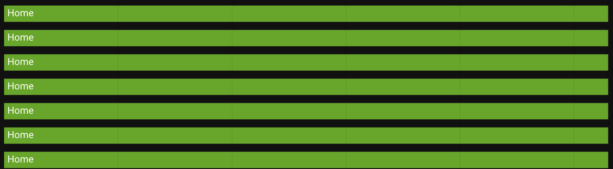

# nmap_tracker
nmap_tracker component for Home Assistant

NOTE: Temporary until PR submittal to HASS core

ALSO: For now, this component uses a dev version of python-nmap (bitbucket), but plans to switch back to the package once changes have been incorporated and released. Email coordination is in progress with code owner. See bottom for latest details.


Sample configuration.yaml

```
device_tracker:
# Minimum Required
  - platform: nmap_tracker
    hosts:
     - 192.168.100.0/24

# Default
  - platform: nmap_tracker
    hosts:
     - 192.168.0.0/24
    home_interval: 20
    exclude_active: true
    timeout: 60
    interval_seconds: 300
    include_no_mac: false
    scan_options: "-F --host-timeout 5s"
    local_mac_hostname: "localhost"
    debug_log_level: 2
    new_device_defaults:
      track_new_devices: true
      
# Advanced/Experimental
  - platform: nmap_tracker
    hosts:
     - 192.168.0.0/24
    home_interval: 10
    exclude_active: false
    timeout: 20
    interval_seconds: 90
    include_no_mac: true
    scan_options: " --dns-servers 192.168.0.1 --privileged -n --host-timeout 2s "
    exclude:
     - 192.168.0.69
    local_mac_hostname: "localhostunique"
    exclude_mac:
     - FF:FF:FF:FF:FF:FF
    debug_log_level: 5
    
# Note: Below config for testing ONLY  
  - platform: nmap_tracker
    hosts:
     - www.google.com
    include_no_mac: true
    interval_seconds: 90
    home_interval: 10
    timeout: 30
    interval_seconds: 300
    scan_options: "-sn --privileged --host-timeout 10s"
    debug_log_level: 5
    
```

New OPTIONAL config fields:

- timeout: postive integer in seconds to allow nmap process to perform

- exclude_active is a boolean, enabled by default. When disabled, forces nmap to scan all configured host(s) on every scan. 
>> By default, this component optimizes to only scan for devices that could be marked as 'not_home' within the next <home_interval> minutes. This provides only a single scan for a device to continue to be marked as home. If some device connections are irregular, then a device would toggle back and forth. This is likely the best next option for a user to be able to enable if devices are toggling back and forth, but may increase resource consumption, based on configuration settings.

- local_mac_hostname default is 'localhost', which would create a sensor 'device_tracker.localhost'
- local_mac_hostname can also be a mac to match other created sensors.

- include_no_mac is a boolean, disabled by default. When enabled, if a MAC address is not returned by nmap, it will be included and monitored. Naming scheme will will use hostname, or ip address if unavailable. MAC address is marked as 'XX:XX:XX:XX:XX:XX' in known_devices.xml

- exclude_mac is a list of MAC address to be ignored when returned by nmap results. MAC address entries must be in all caps.

- debug_log_level is integer (1-5) that allows for limited or expanded debug to log, when debug level is active
->> Privacy Warning: debug_log_level of 3+ includes MAC addresses


# Results:
from current HASS nmap_tracker:


from improved with exclude_active (set to false):



# Installation
Recommend to delete known_devices.yaml prior to install. (take a backup first, silly!)

To install, see HASS docs for custom_component install. 
Essentially, place these files in custom_components subfolder. That HASS config folder structure would then look like:
```
configuration.yaml
groups.yaml
...
> custom_components
> > nmap_tracker
> > > __init__.py
> > > device_tracker.py
> > > manifest.json 
```

# Troubleshooting
Recommendations for users with issues:
- set configuration.yaml to have only nmap_device tracker
- alter log level, as below
- logs will include the actual nmap command performed if valid options are provided
-- attempt to perform command within same execution as hass
-- such as for docker: 
```docker exec <container-name>> nmap <options> <hosts>```

If you still have issues, create an Issue here and please:
- set debug_log_level to 5
- execute for at lengthy period (30+ min?) and upload log to github issue
```
logger:
  default: warning
  logs:
    homeassistant.components.device_tracker: debug
    custom_components.nmap_tracker: debug
```

# Status

I believe this update resolves the below issues

26553
Nmap tracker keep rediscovering excluded hosts with DHCP #26553

31986
nmap_tracker.device_tracker reports "No MAC address found for" itself #31986

33281
Issue with nmap_tracker since 107.6 #33281

34813
Log spam: "Updating device list from legacy took longer than the scheduled scan interval" #34813

>>> Essentially, you will see this line in your log on every nmap scan:
[homeassistant.components.device_tracker] Updating device list from legacy took longer than the scheduled scan interval 0:05:00


Further thoughts:

>> By default, nmap is doing reverse DNS lookups for devices to get names, so that also could be causing some user's issues and hangs. Further code improvements should incorporate so that this action is not completed every scan, but simply on a startup/interval basis. Some of the examples above control where DNS requests go and/or disable it.

>> interval_seconds: I really recommend no smaller than the default 300 (5 min). I've seen some posts of sub 60 seconds, so could translate to a heavy network workload for older devices across an entire subnet.

>> Nmap results return could also be getting stalled by a single host or subnet, so recommending for users to define seperate instances of nmap device tracker for seperate subnets or for sporatic network responsiveness. Each device_tracker instance translates a different nmap process that could be either succeed or fail. It's defined in the user's config how each group is segmented, but multiple host line definitions are combined to a single process call for each nmap device tracker instance.

>> Other failure causes could simply be resource limitations, such as local computing hardware, network delays/errors, wifi reception... If a nmap scan can't complete in enough time that a device is subsequently marked 'not_home', it then would only to be toggled back to 'home' when the scan completed. All this definitely would imply either a timing or resource bottleneck.


Qs for HASS team:

>> Is a default MAC address of 'xx:xx:xx:xx:xx:xx' acceptable in known_devices.xml ?

>> How would a duplicate device_tracker be handled by HASS? Would each update clobber the other?
-- this is possible since the user can define any mac address in the config for localhost, so does this need to be blocked at startup?


Latest:

- 2021.02.12 - PR for python-nmap library in progress
-- email sent to code owner for review and evaluation

